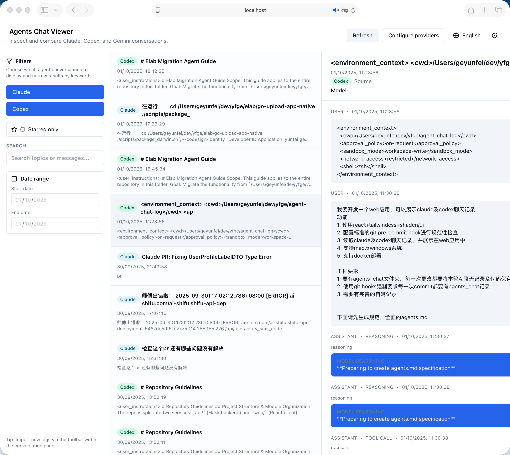
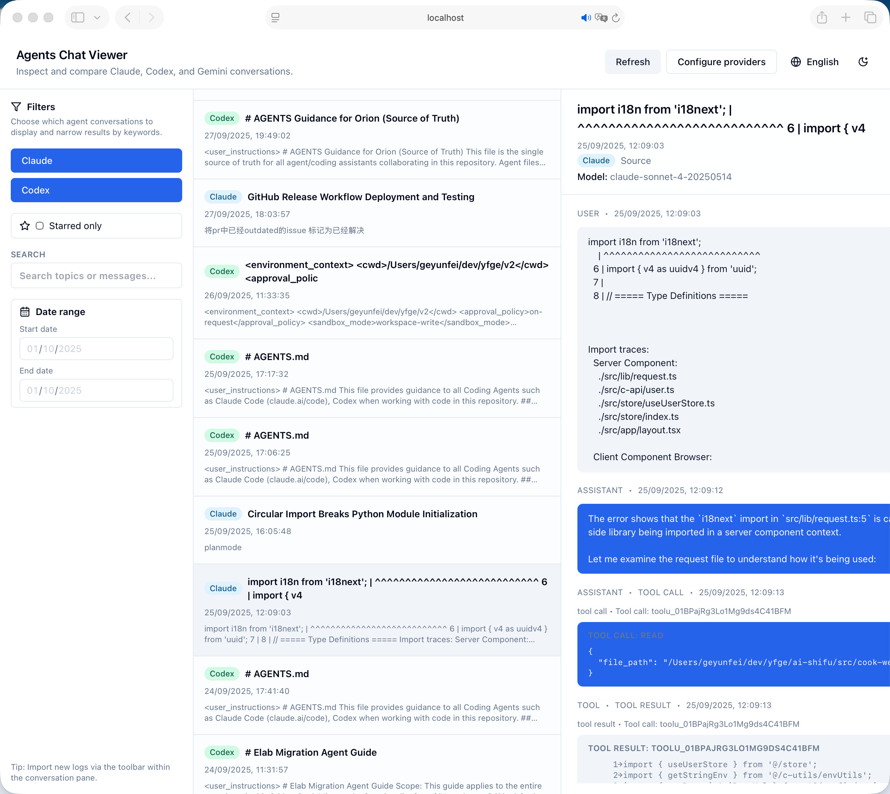

# TalkReplay 简介

TalkReplay 是一个面向 vibe coding 场景的对话复盘工具，可以把 Claude 与 Codex 的聊天记录转化为可浏览、可搜索、可分享的会话时间线，帮助你整理灵感、总结经验并回放协作过程。

- **语言切换：** [English](README.md) · [中文说明](README.zh.md)
- **技术栈：** Next.js 14（App Router）、React、TypeScript、Tailwind CSS、shadcn/ui、Zustand、React Query
- **支持来源：** Claude（`~/.claude/projects`）、Codex（`~/.codex/sessions`），Gemini 规划中
- **部署环境：** macOS、Windows、本地浏览器导入、Docker

## 核心能力

- 轻量级 Node API 和可插拔适配器，自动增量导入 Claude/Codex 会话
- 统一的消息/时间戳规范，便于关键词搜索、过滤、收藏和日期筛选
- 左侧会话列表 + 右侧详情视图，支持星标、增量刷新签名、元数据展示
- `agents_chat/` 记录每一轮 AI 协作，并通过 Husky hook 强制校验流程

## 界面预览





## 本地开发

```bash
pnpm install
pnpm dev -- --port 3002
```

常用脚本：

- `pnpm lint`：运行 ESLint（包含 Tailwind 排序校验）
- `pnpm test`：Vitest + React Testing Library
- `pnpm build`：Next.js 生产构建
- `pnpm format:fix`：Prettier 自动排版

首次启动会弹出目录配置向导，可直接填写 Claude/Codex 日志目录，或通过环境变量自动填充（见下）。配置通过安全的 localStorage 包装器持久化，并在超额时回退到内存存储。

## 提供者目录配置

```bash
NEXT_PUBLIC_CLAUDE_ROOT=/Users/you/.claude/projects
NEXT_PUBLIC_CODEX_ROOT=/Users/you/.codex/sessions
NEXT_PUBLIC_GEMINI_ROOT=/path/to/gemini/logs # 可选
```

后端同样支持 `CLAUDE_ROOT`、`CODEX_ROOT`、`GEMINI_ROOT` 环境变量；归一化逻辑位于 `src/config/providerPaths.ts`。

### 协作规范

- 每次 AI 协作需新增 `agents_chat/` 记录，按时间戳命名并包含 Summary / Code Highlights / Self-Tests 等段落
- Husky `pre-commit` 钩子会验证记录、执行 `pnpm lint` 与 `pnpm test`
- Provider 适配器位于 `src/lib/providers/`，会话模型定义在 `src/types/chat.ts`

## Docker 运行

```bash
docker build -t talk-replay .
docker run \
  -p 3000:3000 \
  -e NEXT_PUBLIC_CLAUDE_ROOT=/app/data/claude \
  -e NEXT_PUBLIC_CODEX_ROOT=/app/data/codex \
  -e CLAUDE_ROOT=/app/data/claude \
  -e CODEX_ROOT=/app/data/codex \
  -v "$HOME/.claude/projects":/app/data/claude:ro \
  -v "$HOME/.codex/sessions":/app/data/codex:ro \
  talk-replay
```

使用 docker-compose：

```bash
CLAUDE_LOGS_PATH="$HOME/.claude/projects" \
CODEX_LOGS_PATH="$HOME/.codex/sessions" \
APP_PORT=3000 \
docker compose up --build
```

如需演示内置样例，可将 `CLAUDE_LOGS_PATH=./fixtures/claude`、`CODEX_LOGS_PATH=./fixtures/codex` 再执行 compose。容器会同时注入运行时与 `NEXT_PUBLIC_*` 环境变量，免去手动配置。

## 测试与质量

- Husky hook 会在提交前运行 `pnpm lint`、`pnpm test` 并校验 `agents_chat` 目录
- Vitest 集成测试覆盖 `/api/sessions` 与 `/api/sessions/detail`
- 规划支持 Storybook 组件验收与可选 Playwright 冒烟测试

## 更多资料

- `tasks.md`：里程碑进度（阶段 1 专注本地复盘，阶段 2 引入共享后端）
- `docs/browser-file-access.md`：浏览器本地导入能力对比
- `agents.md`：vibe coding 协作规范

未来计划：Gemini 会话、虚拟化列表、键盘快捷键、团队协作后端、导出分享工具等。

## 许可证

MIT
