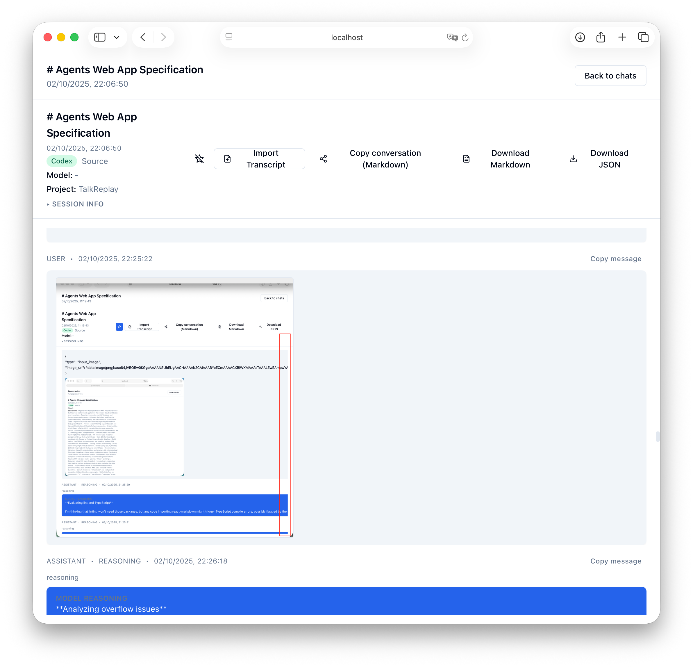
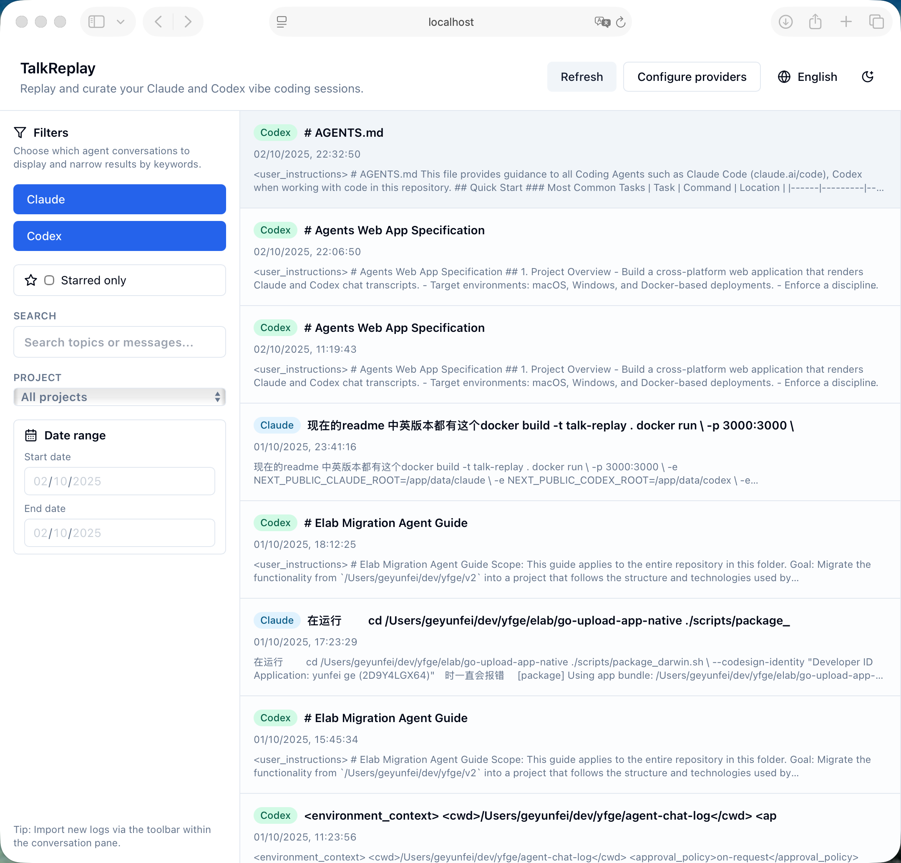
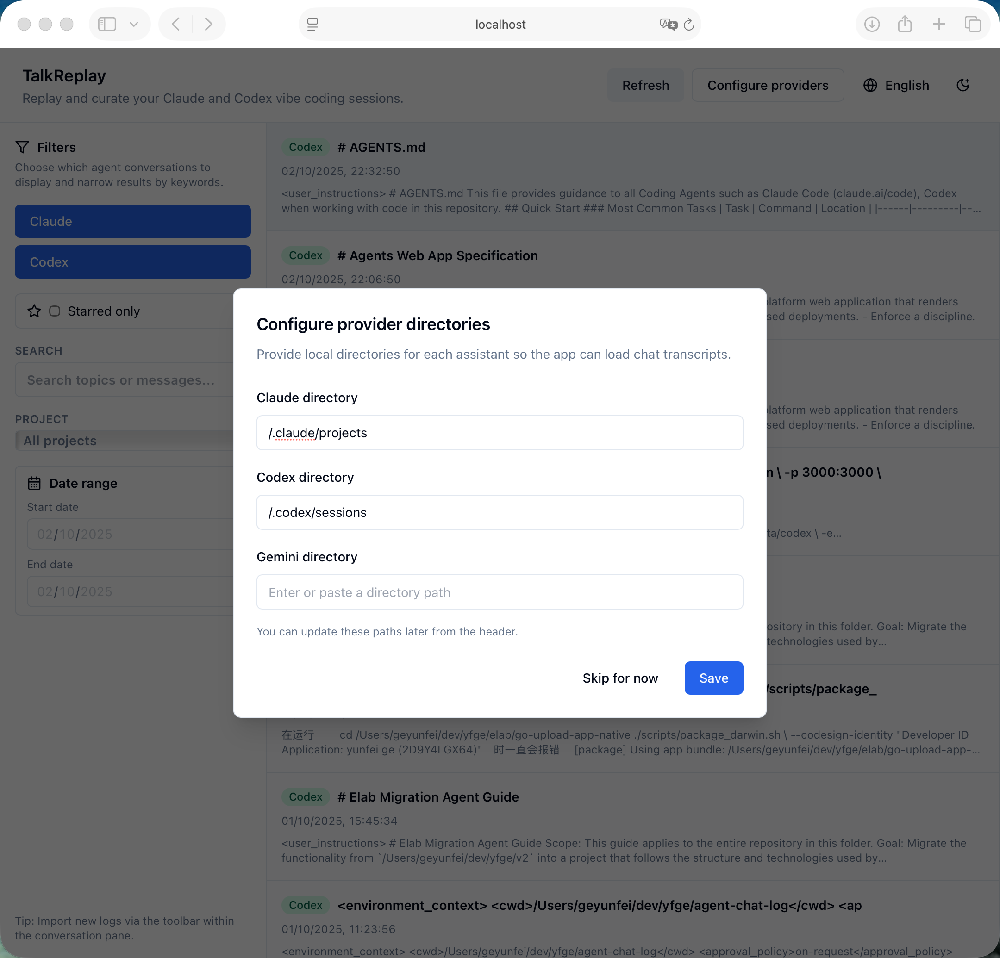

# TalkReplay 简介

TalkReplay 是一个面向 vibe coding 场景的对话复盘工具，可以把 Claude 与 Codex 的聊天记录转化为可浏览、可搜索、可分享的会话时间线，帮助你整理灵感、总结经验并回放协作过程。

- **语言切换：** [English](README.md) · [中文说明](README.zh.md)
- **技术栈：** Next.js 14（App Router）、React、TypeScript、Tailwind CSS、shadcn/ui、Zustand、React Query
- **支持来源：** Claude（`~/.claude/projects`）、Codex（`~/.codex/sessions`），Gemini 规划中
- **部署环境：** macOS、Windows、本地浏览器导入、Docker
- **协作方式：** 按 vibe coding 最佳实践组织，配套 `agents_chat/` 日志、`tasks.md` 任务板以及 Husky 强制检查

## 核心能力

- 轻量级 Node API 和可插拔适配器，自动增量导入 Claude/Codex 会话
- 统一的消息/时间戳规范，便于关键词搜索、过滤、收藏和日期筛选
- 左侧会话列表 + 右侧详情视图，支持星标、增量刷新签名、元数据展示
- `agents_chat/` 记录每一轮 AI 协作，并通过 Husky hook 强制校验流程
- 展示一套完整的 vibe coding 流程，便于在其它仓库复用

## Vibe Coding 工作流

TalkReplay 本身就是一个 vibe coding 标杆项目：

- `agents_chat/` 目录使用时间戳 Markdown 归档每次与 AI 的对话、决策与自测命令，保证信息可追溯。
- Husky `pre-commit` 钩子只有在新增记录并通过 `pnpm lint`、`pnpm test` 后才允许提交，确保质量闭环。
- `tasks.md` 维护里程碑清单，让每一次增量提交都对齐既定计划。
- `agents.md` 与 `docs/` 中的规范/文档，为团队协作提供统一准则。

## 界面预览





### 更多界面






## 本地开发

```bash
pnpm install
pnpm dev -- --port 3002
```

常用脚本：

- `pnpm lint`：运行 ESLint（包含 Tailwind 排序校验）
- `pnpm test`：Vitest + React Testing Library
- `pnpm build`：Next.js 生产构建
- `pnpm format:fix`：Prettier 自动排版

首次启动会弹出目录配置向导，可直接填写 Claude/Codex 日志目录，或通过环境变量自动填充（见下）。配置通过安全的 localStorage 包装器持久化，并在超额时回退到内存存储。

## 提供者目录配置

默认路径（按操作系统）

```bash
NEXT_PUBLIC_CLAUDE_ROOT=/Users/you/.claude/projects   # macOS/Linux 默认
NEXT_PUBLIC_CODEX_ROOT=/Users/you/.codex/sessions     # macOS/Linux 默认
NEXT_PUBLIC_GEMINI_ROOT=/path/to/gemini/logs # 可选
```

Windows 示例

```
# PowerShell
$env:CLAUDE_ROOT="C:\\Users\\<你>\\.claude\\projects"
$env:CODEX_ROOT="C:\\Users\\<你>\\.codex\\sessions"
$env:NEXT_PUBLIC_CLAUDE_ROOT=$env:CLAUDE_ROOT
$env:NEXT_PUBLIC_CODEX_ROOT=$env:CODEX_ROOT

# Cmd
set CLAUDE_ROOT=C:\Users\<你>\.claude\projects
set CODEX_ROOT=C:\Users\<你>\.codex\sessions
set NEXT_PUBLIC_CLAUDE_ROOT=%CLAUDE_ROOT%
set NEXT_PUBLIC_CODEX_ROOT=%CODEX_ROOT%
```

Linux/macOS 示例

```bash
export CLAUDE_ROOT="$HOME/.claude/projects"
export CODEX_ROOT="$HOME/.codex/sessions"
export NEXT_PUBLIC_CLAUDE_ROOT="$CLAUDE_ROOT"
export NEXT_PUBLIC_CODEX_ROOT="$CODEX_ROOT"
```

WSL2 注意：从 WSL 里启动 Docker 时，使用 `/mnt/c/Users/<你>/.claude/projects` 与 `/mnt/c/Users/<你>/.codex/sessions` 挂载。

后端同样支持 `CLAUDE_ROOT`、`CODEX_ROOT`、`GEMINI_ROOT` 环境变量；归一化逻辑位于 `src/config/providerPaths.ts`。

### 会话管线

- Provider 适配器存放在 `src/lib/providers/`，共享的会话模型定义在 `src/types/chat.ts`。
- 增量导入基于文件签名，避免重复解析并在 UI 中呈现错误提醒。
- `fixtures/` 目录提供与真实 Claude/Codex 目录结构一致的示例数据，便于离线演示。

## 生产部署

### 方案一：Docker + 目录挂载

```bash
docker build -t talk-replay .
docker run \
  -p 3000:3000 \
  -e NEXT_PUBLIC_CLAUDE_ROOT=/app/data/claude \
  -e NEXT_PUBLIC_CODEX_ROOT=/app/data/codex \
  -e CLAUDE_ROOT=/app/data/claude \
  -e CODEX_ROOT=/app/data/codex \
  -v "$HOME/.claude/projects":/app/data/claude:ro \
  -v "$HOME/.codex/sessions":/app/data/codex:ro \
  talk-replay
```

Windows PowerShell

```powershell
docker run `
  -p 3000:3000 `
  -e NEXT_PUBLIC_CLAUDE_ROOT=/app/data/claude `
  -e NEXT_PUBLIC_CODEX_ROOT=/app/data/codex `
  -e CLAUDE_ROOT=/app/data/claude `
  -e CODEX_ROOT=/app/data/codex `
  -v C:\Users\<你>\.claude\projects:/app/data/claude:ro `
  -v C:\Users\<你>\.codex\sessions:/app/data/codex:ro `
  talk-replay
```

WSL2（在 Ubuntu shell 中）

```bash
docker run \
  -p 3000:3000 \
  -e NEXT_PUBLIC_CLAUDE_ROOT=/app/data/claude \
  -e NEXT_PUBLIC_CODEX_ROOT=/app/data/codex \
  -e CLAUDE_ROOT=/app/data/claude \
  -e CODEX_ROOT=/app/data/codex \
  -v /mnt/c/Users/<你>/.claude/projects:/app/data/claude:ro \
  -v /mnt/c/Users/<你>/.codex/sessions:/app/data/codex:ro \
  talk-replay
```

使用 docker-compose：

```bash
CLAUDE_LOGS_PATH="$HOME/.claude/projects" \
CODEX_LOGS_PATH="$HOME/.codex/sessions" \
APP_PORT=3000 \
docker compose up --build
```

如需演示内置样例，可将 `CLAUDE_LOGS_PATH=./fixtures/claude`、`CODEX_LOGS_PATH=./fixtures/codex` 再执行 compose。容器会同时注入运行时与 `NEXT_PUBLIC_*` 环境变量，免去手动配置。

Windows compose（PowerShell）

```powershell
$env:CLAUDE_LOGS_PATH="C:\\Users\\<你>\\.claude\\projects";
$env:CODEX_LOGS_PATH="C:\\Users\\<你>\\.codex\\sessions";
$env:APP_PORT=3000;
docker compose up --build
```

容器只能读取挂载进来的目录，运行后可在应用内的「提供者目录」向导中确认 `/app/data/**`
是否就绪；未挂载的宿主机路径在容器内部无法直接访问。

### 方案二：本机构建 + 本地路径

如果直接在宿主机运行生产服务，可先构建再注入本地日志目录：

```bash
pnpm build
CLAUDE_ROOT="$HOME/.claude/projects" \
CODEX_ROOT="$HOME/.codex/sessions" \
NEXT_PUBLIC_CLAUDE_ROOT="$CLAUDE_ROOT" \
NEXT_PUBLIC_CODEX_ROOT="$CODEX_ROOT" \
pnpm start
```

Windows PowerShell：

```powershell
pnpm build
$env:CLAUDE_ROOT="C:\\Users\\<你>\\.claude\\projects"
$env:CODEX_ROOT="C:\\Users\\<你>\\.codex\\sessions"
$env:NEXT_PUBLIC_CLAUDE_ROOT=$env:CLAUDE_ROOT
$env:NEXT_PUBLIC_CODEX_ROOT=$env:CODEX_ROOT
pnpm start
```

也可以利用 Next.js 独立产物（`next.config.mjs` 指定了 `output: "standalone"`），直接用 Node
启动。请确保 `.next/standalone`、`.next/static`、`public` 目录位于同级，以便静态资源正确
解析：

```bash
pnpm build
CLAUDE_ROOT="$HOME/.claude/projects" \
CODEX_ROOT="$HOME/.codex/sessions" \
NEXT_PUBLIC_CLAUDE_ROOT="$CLAUDE_ROOT" \
NEXT_PUBLIC_CODEX_ROOT="$CODEX_ROOT" \
PORT=3000 \
NODE_ENV=production \
node .next/standalone/server.js
```

Windows PowerShell：

```powershell
pnpm build
$env:CLAUDE_ROOT="C:\\Users\\<你>\\.claude\\projects"
$env:CODEX_ROOT="C:\\Users\\<你>\\.codex\\sessions"
$env:NEXT_PUBLIC_CLAUDE_ROOT=$env:CLAUDE_ROOT
$env:NEXT_PUBLIC_CODEX_ROOT=$env:CODEX_ROOT
$env:PORT=3000
$env:NODE_ENV="production"
node .next/standalone/server.js
```

根据实际存储位置调整路径。通过环境变量保持与 Docker 配置一致，避免在代码里写死宿主机专用路径。
若直接在宿主机运行，也可以不设置环境变量，启动后通过「提供者目录」对话框手动指定任意
可读目录；环境变量仅提供默认值，便于与 Docker 场景对齐。

## 测试与质量

- Husky hook 会在提交前运行 `pnpm lint`、`pnpm test` 并校验 `agents_chat` 目录
- Vitest 集成测试覆盖 `/api/sessions` 与 `/api/sessions/detail`
- 规划支持 Storybook 组件验收与可选 Playwright 冒烟测试

## 更多资料

- `tasks.md`：里程碑进度（阶段 1 专注本地复盘，阶段 2 引入共享后端）
- `docs/browser-file-access.md`：浏览器本地导入能力对比
- `agents.md`：vibe coding 协作规范

未来计划：Gemini 会话、虚拟化列表、键盘快捷键、团队协作后端、导出分享工具等。

## 许可证

[MIT](LICENSE)
